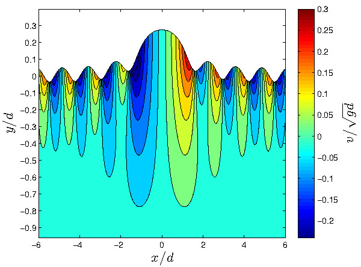

# BabenkoCG

This function computes the steady irrotational surface solitary (classical and generalized) capillary-gravity wave solutions of the full Euler equations (homogeneous, incompressible and perfect fluids). The wave is defined by its initial Froude and Bond numbers (Fr, Bo) and the result is about twelve digits accurate. The method works for all but the highest waves.

**NOTA BENE**: The execution of this function requires the presence of the Optimization Toolbox, namely we use the fsolve() function of this toolbox to solve the nonlinear nonlocal Babenko equation.

## References:

More details on the methods used in these scripts can be found in the following references:

* D. Clamond, D. Dutykh & A. Duran. *[A plethora of generalised solitary gravity-capillary water waves](https://hal.archives-ouvertes.fr/hal-01081798/)*. Submitted, 2015

======

## Authors

D. Dutykh, D. Clamond & A. Duran
[www.denys-dutykh.com](http://www.denys-dutykh.com/)  
[math.unice.fr/~didierc/](http://math.unice.fr/~didierc/)
[https://www.researchgate.net/profile/Angel_Duran3](https://www.researchgate.net/profile/Angel_Duran3)

## Licence

Open source under the [MIT licence](http://opensource.org/licenses/MIT).